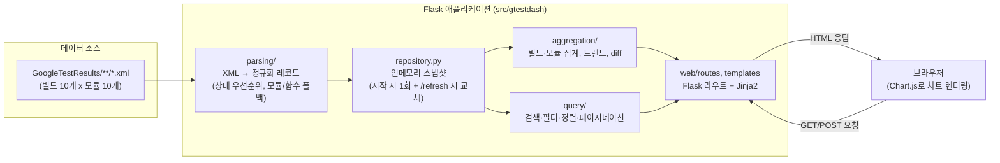
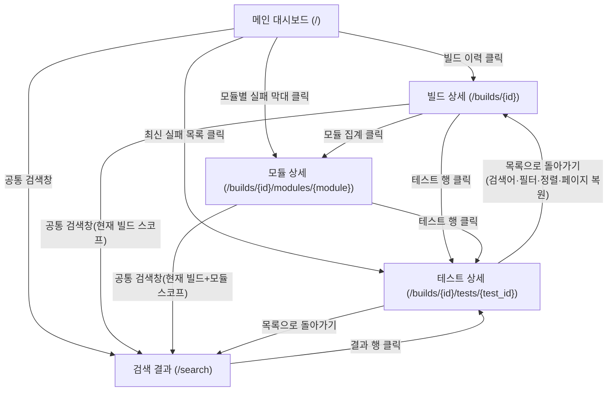

# GoogleTest 결과 대시보드

Jenkins 빌드마다 쌓이는 GoogleTest XML 결과를 읽어, 브라우저에서 **최신 빌드 현황·실패율
트렌드·모듈별 실패 분포·테스트 상세**를 한눈에 볼 수 있게 해주는 Python(Flask) 웹
애플리케이션입니다.

> 이 저장소의 `GoogleTestResults/`는 실습/테스트용으로 만든 **합성(가상) 데이터**입니다.
> 실제 차량, ECU, 안전등급, 인증과는 무관합니다.

## 미리보기

앱을 직접 실행하지 않아도 `target/` 폴더의 정적 HTML 스냅샷을 브라우저로 열어 바로 볼 수
있습니다(샘플 데이터 기준으로 미리 렌더링해 둔 화면입니다).

| 파일 | 화면 |
|---|---|
| [`target/index.html`](target/index.html) | 메인 대시보드 — 최신 빌드 요약, 실패율 트렌드, 모듈별 실패 분포 |
| [`target/build_10.html`](target/build_10.html) | 빌드 상세 — 빌드 10 요약 + 전체 테스트 목록 |
| [`target/module_child_lock_controller.html`](target/module_child_lock_controller.html) | 모듈 상세 — `ChildLockController`의 빌드별 실패율 추이 |
| [`target/test_detail_example.html`](target/test_detail_example.html) | 테스트 상세 — 실패 메시지/파일/줄 번호 |
| [`target/search_results_failed.html`](target/search_results_failed.html) | 검색 결과 — 전체 빌드의 실패 테스트만 필터링 |

이 스냅샷은 "미리보기"용이라 화면 안의 링크(다른 빌드/모듈로 이동 등)는 실제 서버가 있어야
동작합니다. 실제로 돌아다니며 써보려면 아래 "빠른 시작"으로 서버를 띄우세요.

## 주요 기능

- **메인 대시보드**: 최신 빌드 요약(전체/통과/실패/실패율), 직전 빌드 대비 증감, 빌드별
  실패율 트렌드 차트, 모듈별 실패 분포(최신 빌드/특정 빌드/전체 누적 전환 가능)
- **빌드 상세 / 모듈 상세**: 빌드 간 이전·다음 이동, 모듈별 집계, 모듈의 빌드별 실패율 추이
- **테스트 상세**: 실패 메시지·파일 경로·줄 번호를 원문 그대로(줄바꿈/들여쓰기 보존) 표시
- **검색/필터/정렬/페이지네이션**: 모듈명·함수명·테스트명·실패 메시지 등 9개 필드 통합 검색,
  상태/빌드/모듈 필터, 실패 테스트만 보기, 25/50/100건 페이지네이션
- **새로고침**: 버튼 클릭으로 XML을 다시 스캔(재시작 없이 새 빌드 인식)
- **오류 내성**: XML 하나가 손상돼도 나머지는 정상 표시하고 경고 배너로 안내

## 아키텍처



- 인증·데이터베이스가 없는 **읽기 전용 조회 앱**입니다. XML을 매 요청마다 다시 파싱하지 않고,
  시작 시 1회 + `POST /refresh` 호출 시에만 인메모리 스냅샷을 통째로 교체합니다.
- 자세한 설계 배경은 [`CLAUDE.md`](CLAUDE.md)의 "아키텍처 및 구현 계획"을 참고하세요.

## 페이지 흐름



## 빠른 시작

```bash
git clone https://github.com/SyneticsCorp/GoogleTestDashboard.git
cd GoogleTestDashboard

python -m venv .venv
source .venv/Scripts/activate        # Windows(Git Bash). macOS/Linux는 source .venv/bin/activate
pip install -r requirements.txt

python -m flask --app "src/gtestdash/web/app:createApp" run
# http://127.0.0.1:5000 접속 (기본 데이터 소스: ./GoogleTestResults)
```

### 테스트 실행

```bash
python -m pytest -q                     # 전체 (unit + integration + e2e), 287개
python -m pytest tests/unit -q          # 파싱/집계/쿼리 순수 함수 단위 테스트
python -m pytest tests/integration -q   # Flask 라우트 통합 테스트
python -m pytest tests/e2e -q           # Playwright 브라우저 E2E (최초 1회: playwright install chromium)
```

### 정적 미리보기 다시 생성

샘플 데이터가 바뀌었거나 화면을 수정한 뒤 `target/`의 미리보기를 갱신하려면:

```bash
python scripts/generate_static_snapshot.py
```

## 데이터 소스

`GoogleTestResults/01`~`10` 폴더가 각각 Jenkins 빌드 1개에 대응하며, 폴더마다 모듈별
GoogleTest XML이 10개씩 들어 있습니다(전체 100개 XML, 12,000개 테스트 레코드). 구조는 다음과
같습니다.

```
testsuites
└─ testsuite
   ├─ properties   (module, tested_function, jenkins_build_number 등)
   └─ testcase
      └─ failure   (실패한 경우)
```

정확한 필드 매핑과 판정 규칙(상태 우선순위, 모듈/함수 대체 순서, 집계 재계산 등)은
[`Requirements.md`](Requirements.md)와 [`CLAUDE.md`](CLAUDE.md)에 정리돼 있습니다.

## 품질 보증

- **단위/통합 테스트**(`tests/unit`, `tests/integration`): 개발 전 과정을 TDD(Red-Green-
  Refactor)로 진행하며 함께 작성했습니다.
- **시스템 테스트 케이스**(`TestCase_Template.xlsx`): ISO 26262/A-SPICE/ISO 29119/ISO 25000
  방법론에 따라 요구사항 기반으로 작성한 블랙박스 테스트 케이스입니다.
- **브라우저 E2E 테스트**(`tests/e2e/test_e2e_fr*.py`): 위 xlsx 케이스 중 실제 데이터로
  재현 가능한 것을 Playwright로 옮긴 것으로, 테스트명에 xlsx의 `TC_ID`가 남아 있어
  케이스↔코드 추적이 가능합니다.
- **최종 인수 기준 대응표**(`docs/acceptance-traceability.md`): `Requirements.md` §7의 모든
  수치와 §8의 완료 판정 7개 조건이 어느 테스트로 검증되는지 정리한 문서입니다.

## 프로젝트 구조

```
src/gtestdash/
├── config.py         결과 경로 설정 (FR-001)
├── parsing/          XML → 정규화 레코드
├── aggregation/       빌드·모듈 집계, 트렌드, diff
├── query/             검색·필터·정렬·페이지네이션
├── repository.py      인메모리 스냅샷 조립/새로고침
└── web/                Flask 라우트, 템플릿, 정적 자산
tests/
├── unit/               순수 함수 단위 테스트
├── integration/         Flask 라우트 통합 테스트
├── e2e/                 Playwright 브라우저 테스트
└── fixtures/edge_cases/ 손상 XML 등 엣지 케이스 픽스처
docs/                    대화 기록, 인수 기준 대응표
target/                  샘플 데이터 기준 정적 HTML 미리보기
```

## 더 읽어보기

- [`Requirements.md`](Requirements.md) — 전체 기능 요구사항(FR-001~036), 인수 기준
- [`CLAUDE.md`](CLAUDE.md) — 구현 규칙, 아키텍처 결정, 개발 프로세스
- [`docs/acceptance-traceability.md`](docs/acceptance-traceability.md) — 인수 기준 대응표
- [`docs/conversation-log.md`](docs/conversation-log.md) — 개발 과정 요약 기록
- [`docs/conversation-transcript.md`](docs/conversation-transcript.md) — 대화 원문 기록
